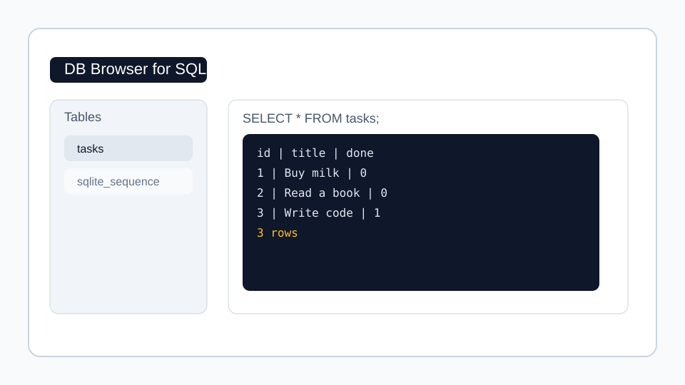

# Task API with SQLite Persistence

A CRUD API for managing tasks where the storage layer now lives in a real SQLite database instead of an in-memory array. The API surface stays the same, but data survives server restarts.

## Why SQLite was chosen

SQLite is a lightweight, file-based database that requires no separate server process. It is ideal for small projects and local development, and it fits this assignment perfectly because the database lives in a single file: `tasks.db`.

## Quick Start

```bash
npm start
```

The API will start on http://localhost:3000 and automatically create `tasks.db` if it does not already exist.

### First Run Behavior

On the first launch, the server will:

- create the `tasks` table if it does not exist
- insert three example tasks if the table is empty

## Features

- ✅ Full CRUD operations over the same endpoints as Assignment 1
- ✅ Persistent storage in SQLite
- ✅ Proper HTTP status codes (200, 201, 204, 400, 404)
- ✅ Input validation for task titles
- ✅ Swagger UI at `/docs` for interactive testing
- ✅ OpenAPI 3.0 specification

## API Endpoints

| Method | Endpoint | Description | Status Codes |
|--------|----------|-------------|--------------|
| GET | `/` | Hello server message | 200 |
| GET | `/health` | Health check | 200 |
| GET | `/info` | API information | 200 |
| GET | `/tasks` | List all tasks | 200 |
| GET | `/tasks/:id` | Get single task | 200, 404 |
| POST | `/tasks` | Create new task | 201, 400 |
| PUT | `/tasks/:id` | Update task | 200, 400, 404 |
| DELETE | `/tasks/:id` | Delete task | 204, 404 |

## Database File

The database file is stored at the project root as `tasks.db`.

If you delete the file, the server will create it again on the next start, but the previous data will be lost.

## Example Requests

### Get all tasks

```bash
curl -i http://localhost:3000/tasks
```

### Create a new task

```bash
curl -i -X POST http://localhost:3000/tasks \
  -H "Content-Type: application/json" \
  -d '{"title":"Learn Node.js"}'
```

### Update a task

```bash
curl -i -X PUT http://localhost:3000/tasks/1 \
  -H "Content-Type: application/json" \
  -d '{"done":true}'
```

### Delete a task

```bash
curl -i -X DELETE http://localhost:3000/tasks/1
```

## Example SQL Queries

The following queries were used while exploring the database:

```sql
SELECT * FROM tasks;
SELECT * FROM tasks WHERE done = 1;
SELECT COUNT(*) FROM tasks;
```

## Database Viewer Screenshot



## Project Structure

```text
.
├── server-builtin.js    # Main HTTP server using SQLite
├── server.js            # Express-based variant using SQLite
├── openapi.json         # OpenAPI 3.0 specification
├── package.json         # npm metadata
├── tasks.db             # SQLite database file (created automatically)
├── database-viewer.svg  # Screenshot example for the README
└── README.md            # This file
```

## Notes

- The API remains compatible with the same CRUD endpoints from Assignment 1.
- Tasks are stored in a `tasks` table with `id`, `title`, and `done` columns.
- Data persists across restarts because it is written to `tasks.db`.
